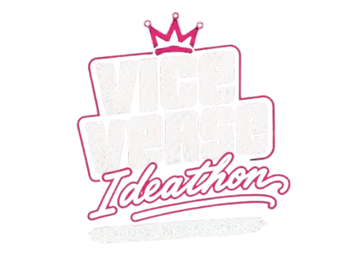

<div align="center">
  
  <h1>🌴 Vice Verse Admin Portal (Version 1.0) 🌴</h1>
  
  <p>
    
    
    
  </p>

  <p><em>The central administrative hub for the Vice Verse 2026 Ideathon.</em></p>
</div>

Built with a sleek, vibrant, **GTA Vice City-inspired aesthetic**, this dashboard provides all the necessary tools to manage the event seamlessly.

## ✨ Features

- 🎮 **GTA Vice City Theme**: High contrast dark-mode UI with neon accents (Rockstar Yellow, Neon Pink, Neon Cyan), glassmorphism effects, and the iconic `Pricedown` GTA font for heavy typography.
- 📅 **Event Flow Dashboard**: A real-time tracker for the entire Ideathon schedule (Check-in, Keynote, Hacking, Judging, etc.).
- 👨‍⚖️ **Judges Portal**: A dedicated scoring interface for tracking team progress, reviewing pitches, and assigning points across various criteria.
- 👥 **Participants Portal**: Administrative view of all registered hackers, team formations, and live status.
- ⚙️ **Event Details**: Core information tracking for the Ideathon (Venue: *Sri H. Kempegowda Indoor Sports Complex*, Date: *26th October 2026*).
- 🤝 **Partnership Branding**: Integrated branding natively supporting the IVC (Innovators & Visionaries Club) and VVCE logos seamlessly.

## 🚀 Tech Stack

- **Framework**: React 18
- **Build Tool**: Vite
- **Styling**: Vanilla CSS3 (Custom Variables, Flexbox/Grid, CSS Animations, Custom Font-Faces)
- **Icons**: Lucide React
- **Routing**: React Router (DOM)

## 🛠️ Getting Started

### Prerequisites
Make sure you have [Node.js](https://nodejs.org/) (v16+ recommended) installed.

### Installation

1. Clone the repository:
   ```bash
   git clone https://github.com/DeverGuy/Vise_verse_Admin-Page-.git
   ```
2. Navigate into the directory:
   ```bash
   cd Vise_verse_Admin-Page-
   ```
3. Install dependencies:
   ```bash
   npm install
   ```

### Running Locally

To start the development server with Hot Module Replacement (HMR):
```bash
npm run dev
```
The app will typically be available at `http://localhost:5173`.

### Building for Production

To create a production-ready bundle:
```bash
npm run build
```

## 🎨 Design System

The application utilizes a custom CSS variable system defined in `index.css`:
- **Typography**: Heavily utilizes `Pricedown` (GTA Title Font) paired with `Inter` and `Chakra Petch` for UI readability.
- **Colors**:
  - `var(--bg-color)`: `#050508` (Deep Black)
  - `var(--accent-primary)`: `#FBC815` (Rockstar Yellow)
  - `var(--accent-secondary)`: `#FF007F` (Neon Pink)
  - `var(--accent-tertiary)`: `#00F0FF` (Neon Cyan)

---
*Developed for the IVC Ideathon @ Vidyavardhaka College of Engineering (VVCE).*
